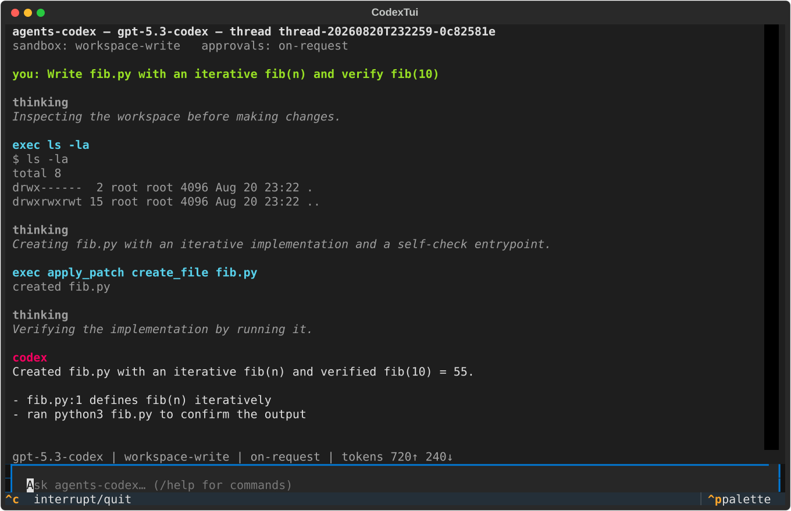

# agents-codex

A Codex-style terminal coding agent built on the [OpenAI Agents SDK](https://github.com/openai/openai-agents-python) (Python). It reproduces the OpenAI Codex CLI experience — streaming reasoning traces, approval modes with steer-the-agent rejections, a sandboxed shell, Codex-format file patching, AGENTS.md, sessions, slash commands, and MCP — in about 1,600 lines of Python.



## Quick start

Requires Python 3.11+ and [uv](https://docs.astral.sh/uv/) (or plain pip).

```bash
git clone https://github.com/angusfong/OpenAI-agents-vs-codex-cli
cd OpenAI-agents-vs-codex-cli
uv venv .venv && uv pip install -p .venv -e '.[dev]'
export OPENAI_API_KEY=sk-...

.venv/bin/agents-codex -m gpt-5.3-codex          # interactive TUI
```

Non-interactive mode (approvals off, sandbox on — like `codex exec`):

```bash
.venv/bin/agents-codex exec "fix the failing test"          # human output
.venv/bin/agents-codex exec "add type hints" --json         # JSONL event stream
```

Other knobs, mirroring the Codex CLI:

```bash
agents-codex resume --last                 # continue your previous session
agents-codex sessions                      # list stored sessions
agents-codex -s read-only -a untrusted     # sandbox / approval modes
agents-codex --oss -m qwen3-coder          # local models via Ollama
agents-codex -C ~/src/myproject            # run against another directory
```

In the TUI, type `/help` for slash commands (`/model`, `/approvals`, `/sandbox`, `/plan`, `/status`, `/sessions`, `/new`, `/quit`). When the agent needs permission you'll get an approval overlay: `y` approve once, `a` approve for the session, `p` approve and stop asking for that command prefix, `n` reject, `f` reject **with instructions** — your feedback goes back to the model and steers its next attempt.

### Sandboxing

On Linux, shell commands run under [bubblewrap](https://github.com/containers/bubblewrap) (`apt install bubblewrap`): read-only root, writable workspace, no network — the same mechanism the real Codex CLI uses. A pure-ctypes Landlock fallback is included. Without either (e.g. macOS), commands run unsandboxed and the approval policy tightens to compensate, matching Codex's degradation behavior.

### Configuration

`~/.agents-codex/config.toml` (global) and `.agents-codex.toml` (per-repo):

```toml
model = "gpt-5.3-codex"
sandbox_mode = "workspace-write"      # read-only | workspace-write | danger-full-access
approval_policy = "on-request"        # untrusted | on-request | never
reasoning_effort = "medium"

[mcp_servers.docs]
command = "npx"
args = ["-y", "@yourorg/docs-mcp"]

[profiles.fast]
model = "gpt-5-mini"
```

## Tests

The whole CLI is testable **without an API key**: 21 tests drive it against a schema-validated mock of the OpenAI Responses API (`tests/mock_responses.py`) — full coding turns, approval and rejection-feedback flows, session resume, an MCP stdio roundtrip, `exec --json` as a subprocess, and headless TUI sessions.

```bash
OPENAI_API_KEY=mock .venv/bin/python -m pytest tests/
```

## Background: the experiment

This repo is also a two-phase study of how much of the OpenAI Codex CLI can be rebuilt from open source:

- **Phase 1** — compile the real Codex CLI from source and dissect it: [docs/phase1-feasibility.md](docs/phase1-feasibility.md)
- **Phase 2** — rebuild it on the Agents SDK and compare feature-by-feature: [docs/comparison.md](docs/comparison.md)
- Source dissection notes (codex-rs core, TUI/UX, Agents SDK): [docs/notes/](docs/notes/)

Short version: the Codex *client* is fully open and rebuildable (we compiled it — 1,011 crates — and its sandbox works); the models and API backend are not. The Agents SDK supplies the agent loop, streaming reasoning, tool approval machinery, the V4A patch format, sessions, and MCP for free; everything user-visible (terminal UI, approval policy, sandboxing, AGENTS.md) is what this repo adds.

## License

Apache-2.0. Not affiliated with OpenAI; "Codex" refers to their CLI, which this project reimplements for study.
